# Ubuntu Server Hardening & Security Automation

## 1. Lab objectives

Default Ubuntu installations include services, packages, and configurations that may not be needed for your specific use case. Hardening disables unnecessary components (e.g., unused network services, default accounts) so there are fewer entry points for attackers.

The final architecture will looked like:

```text
                         Kali Linux
                       Security Tester
                             |
                             | SSH / Nmap
                             |
                             v
                  +----------------------+
                  |    Ubuntu Server     |
                  |----------------------|
                  | SSH                  |
                  | UFW                  |
                  | AppArmor             |
                  | systemd              |
                  | audit/logging         |
                  | unattended-upgrades   |
                  | Bash automation       |
                  +----------------------+
```

---

# 2. Lab requirements

I used virtualbox to host my virtual machines with NAT network configured.

## Machine configuration

### Ubuntu VM

Recommended:

```text
CPU:       2 cores
RAM:       2 (higher ram is usually recommended)
Disk:      30GB
Network:   NATNetwork via virtualbox extension pack
OS:        Ubuntu Server 24.04 LTS
```

### Kali VM

Recommended:

```text
CPU:       2+ cores
RAM:       4 GB+
Network:   Same lab network as Ubuntu
```

>`Note⚠️`: this is not a production server all activities here were carried in a secure lab environment with no access to the internet.

---

# PHASE 1 — BASELINE SECURITY ASSESSMENT

This is one of the most important phases. A baseline security assessment on an Ubuntu server is a systematic evaluation of the server’s configuration and state against a predefined security baseline—a set of minimum security controls and hardening requirements. 

We don't immediately start changing configuration.

First:

> **Understand what you're protecting.**

---

## 3. Operating system information


```bash
cat /etc/os-release
uname -a
hostnamectl
```

Based on the commad above, i was able to establish the following result

```text
OS: Ubuntu 24.04.3 LTS 
Version: 24.04.3 LTS (Noble Numbat)
Kernel: Linux 6.8.0-71-generic
Architecture: x86-64
Hostname: acx
```
**Detailed result**:  [reports/baseline-system.txt](reports/baseline-system.txt)


---

## 4. Current users

Inspecting the current users is highly necessary because an attacker may have created a legit user as a backdoor to muve freely in out the system.

Inspecting current users
```bash
cut -d: -f1 /etc/passwd
```

Output:
```text
root
daemon
bin
sys
sync
games
man
lp
mail
news
uucp
proxy
www-data
backup
list
irc
_apt
nobody
systemd-network
systemd-timesync
dhcpcd
messagebus
systemd-resolve
pollinate
polkitd
syslog
uuidd
tcpdump
tss
landscape
fwupd-refresh
usbmux
sshd
acx
samuel
```

Finding users with interactive shells:

```bash
grep -E '/(bash|sh|zsh)$' /etc/passwd
```

Output:
```text
root:x:0:0:root:/root:/bin/bash
acx:x:1000:1000:Anonymous_CyberX:/home/acx:/bin/bash
samuel:x:1001:1001:,,,:/home/samuel:/bin/bash
```

Inspect UID 0 accounts:

```bash
awk -F: '$3 == 0 {print $1}' /etc/passwd
```
Output:
```text
root
```

Ideally `root` should be the only UID 0 account unless you deliberately created another privileged identity.

---

## 5. Inspect sudo access

Run:

```bash
sudo -l
```
output:
```text
Matching Defaults entries for acx on acx:
    env_reset, mail_badpass,
    secure_path=/usr/local/sbin\:/usr/local/bin\:/usr/sbin\:/usr/bin\:/sbin\:/bin\:/snap/bin, use_pty

User acx may run the following commands on acx:
    (ALL : ALL) ALL
```
According to the result user `acx` is a privileged user and can read, write and execute anything. He pretty much own the systems.

Then:

```bash
getent group sudo # sudo:x:27:acx
```

Inspecting sudo configuration:

```bash
sudo ls -la /etc/sudoers.d/
```
Output:

```text
drwxr-xr-x   2 root root 4096 Aug  5  2025 .
drwxr-xr-x 110 root root 4096 Jul  6 12:04 ..
-r--r-----   1 root root 1068 Jan 29  2024 README
```
What this mean is there are no extra sudo rules configured via drop-in files. All sudo configuration is likely defined in /etc/sudoers. From a security baseline perspective, this is a clean/default state — no unexpected sudoers files and permissions are properly restrictive.

And:

```bash
sudo visudo -c
```
Output:
```text
/etc/sudoers: parsed OK
/etc/sudoers.d/README: parsed OK
```


The last command validates sudo configuration syntax, 
and everything seemed ok, i didn't just stop there and conclude that the server was secured

---

## 6. Inspect running services
This is very necessary as it helps identify currently running services and it also helps to point out services that should not be running.
Run:

```bash
systemctl --type=service --state=running
```

Output:

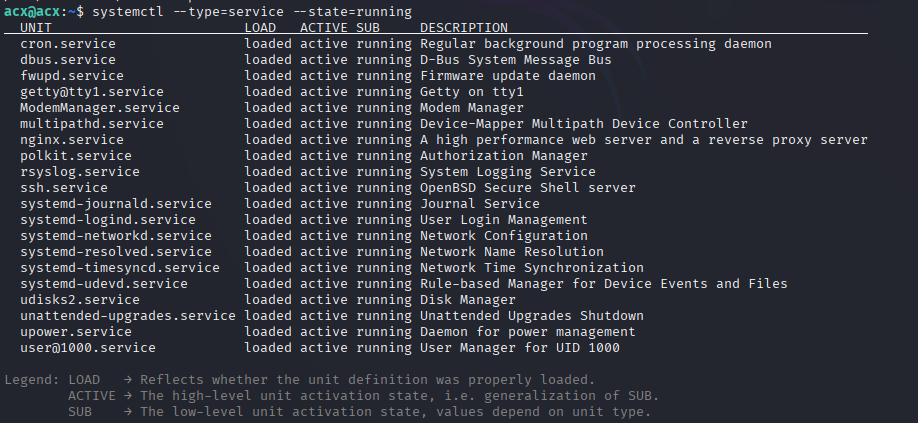

Then:

```bash
systemctl list-unit-files --type=service --state=enabled
```
Output:

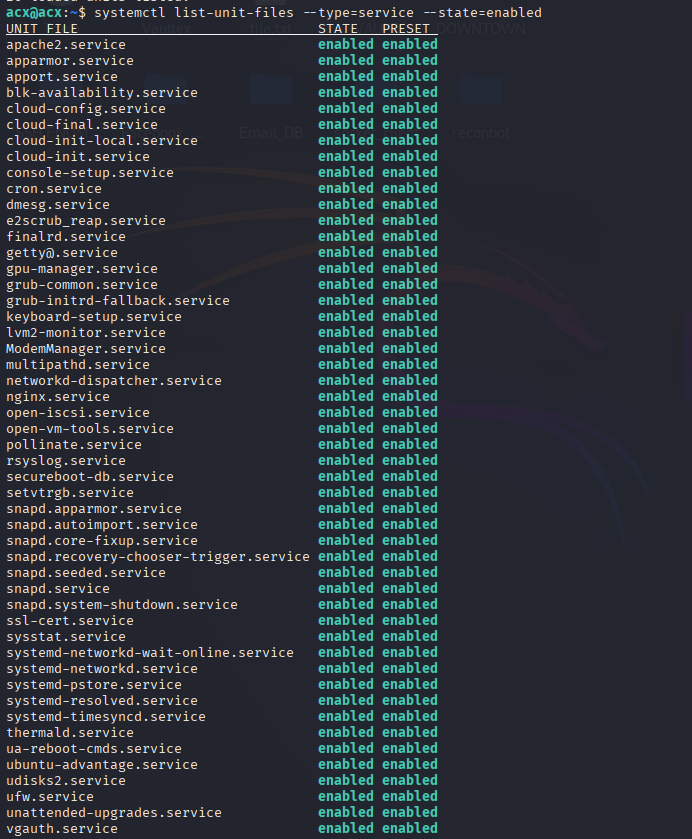

We are looking for services that aren't required.

For example, a server that only needs SSH shouldn't necessarily be running:

```text
Apache
Nginx
FTP
Samba
Bluetooth
Avahi
Mail services
Database servers
```

The correct decision depends on the server's intended role, the main goal of this lab work is to configure SSH on this server which means the only service we should have actively running is the `ssh service`. The result shows series of services that shouldn't be running and the goal is to get rid of those services.

---

## 7. Identify listening ports

The goal here is to identify and document every other ports running which is not port `22` which meant for `ssh.`

Run:

```bash
sudo ss -tulpn
```
Output:

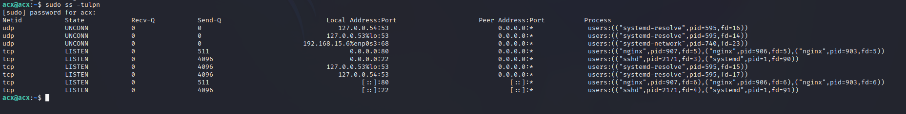

The result shows series of opened ports and the services that triggered them.
Port `22` is normally SSH, Everything else running should be closed.

---

## 8. Inspect firewall state

Run:

```bash
sudo ufw status verbose
```
Output:

```text
Status: inactive
```
Something interesting so far, the firewall is inactive now impplication of that is the server allows request from any source withou restrictions. An attacker can leverage this by running ddos attack or even payload injection since there's no network layer security present.

---

## 9. Inspect SSH

Check whether SSH is installed:

```bash
dpkg -l | grep openssh
```
Normally you would do this if the server is freshly installed and you want to configure SSH on it.

Check the service:

```bash
systemctl status ssh
```
This basically checks of the services is currently running, inmy case yes, because i was only able to conviniently work with it through ssh connection from my kali machine.

Inspect effective SSH configuration:

```bash
sudo sshd -T
```

This is particularly useful because it shows the configuration OpenSSH is actually using.

The SSH service is running with a mostly default Ubuntu configuration. It is not badly misconfigured, but it is not hardened:

 - Password and root key login are allowed.

 - Forwarding and X11 features are enabled unnecessarily.

 - Some legacy MAC algorithms are present.

 - No idle session timeout is configured.

---

## 10. Inspect SSH configuration files

```bash
sudo ls -la /etc/ssh/
```

Inspect:

```bash
sudo grep -vE '^\s*#|^\s*$' /etc/ssh/sshd_config
```

Output:

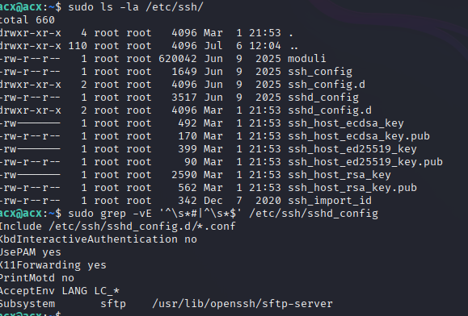

This is me just looking around, inspecting config files before proper hardening begins.

---

## 11. Check updates

Run:

```bash
sudo apt update
```

Then:

```bash
apt list --upgradable
```

Also:

```bash
ubuntu-security-status # this command is deprecated on new version of ubuntu
sudo apt install ubuntu-pro-client
pro security-status # use this instead
```

Output:

```text
95 packages installed:
    692 packages from Ubuntu Main/Restricted repository
    3 packages from Ubuntu Universe/Multiverse repository

To get more information about the packages, run
    pro security-status --help
for a list of available options.

This machine is receiving security patching for Ubuntu Main/Restricted
repository until 2029.
This machine is NOT attached to an Ubuntu Pro subscription.

Ubuntu Pro with 'esm-infra' enabled provides security updates for
Main/Restricted packages until 2034.

Ubuntu Pro with 'esm-apps' enabled provides security updates for
Universe/Multiverse packages until 2034. There is 1 pending security update.

Try Ubuntu Pro with a free personal subscription on up to 5 machines.
Learn more at https://ubuntu.com/pro
```

Ubuntu distributes security updates through its security repositories and maintains security notices for affected packages.

---

# 12. Inspect automatic updates

Check:

```bash
dpkg -l | grep unattended-upgrades
```

Then:

```bash
systemctl status unattended-upgrades
```

Also inspect:

```bash
ls -la /etc/apt/apt.conf.d/
```

Ubuntu documentation notes that `unattended-upgrades` is included in default Ubuntu Server installations and can automatically apply security updates. 
---

## 13. Inspect AppArmor

Ubuntu uses AppArmor as a mandatory access-control mechanism.

Run:

```bash
sudo aa-status
```
Summary output from the result

```text
profiles loaded: 119
profiles in enforce mode: 24
profiles in complain mode: 4
```
Something i mostly don't want to do id disble this AppArmor during hardening as it also offers additional layer of security to the server.

---

## 14. Inspect SUID binaries

Run:

```bash
sudo find / -xdev -perm -4000 -type f 2>/dev/null
```

Then SGID:

```bash
sudo find / -xdev -perm -2000 -type f 2>/dev/null
```

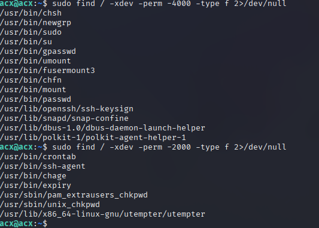

These aren't automatically vulnerabilities.

The objective is to understand which privileged executables exist and whether they're expected.

---

## 15. Inspect world-writable locations

Run:

```bash
sudo find / -xdev -type d -perm -0002 -print 2>/dev/null
```

And:

```bash
sudo find / -xdev -type f -perm -0002 -print 2>/dev/null
```

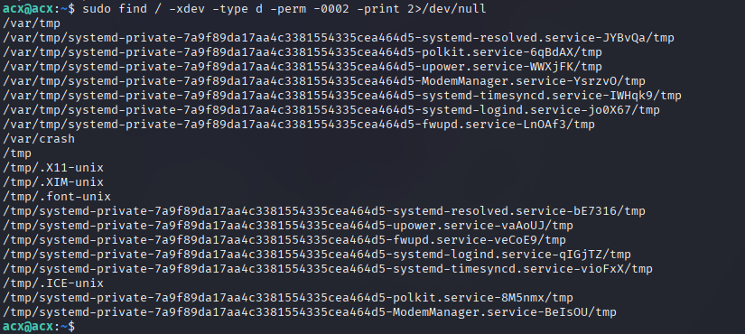

Again, don't automatically chmod everything, that is only for administrator who bare in mind security at every stage, it is worth checking even if there's nothing odd there.

Some applications legitimately require writable directories.

---

## 16. Baseline network scan

From Kali:

```bash
nmap -sS -sV -O "192.168.15.6"
```

Result: [baseline-nmap-scan](reports/baseline-nmap.txt)

This is the:

```text
BEFORE
```

security posture.

---

## 17. Automating a baseline report

As a DevSecOps Engineer, you should proritize automating repitive task that led me to write a bashh scropt to get all this done automatically, result is also generated and report is been built also in the process.

The tool can be found in [baseline.sh](scripts/baseline.sh)

Make executable:

```bash
chmod +x ~/ubuntu-hardening/scripts/baseline.sh
```
Run:

```bash
~/ubuntu-hardening/scripts/baseline.sh
```

Result is stored here: [baseline-result](reports/baseline-20260819-124021.txt)

---

## Ubuntu Server Security Baseline – Analysis

**Overall posture:** This is a **default/minimal Ubuntu 24.04 server with nginx added**, but **not hardened**. It would likely fail a CIS/STIG baseline due to an inactive firewall, weak SSH settings, unnecessary services, and weak AppArmor enforcement.

---

###  Critical / High Findings

| # | Finding | Risk |
|---|---------|------|
| 1 | **Firewall inactive** (`ufw status: inactive`) | No host-based filtering; all listening services are exposed to the network. Critical if this VM is reachable beyond localhost. |
| 2 | **SSH password authentication enabled** (`passwordauthentication yes`) | Exposes SSH to brute-force, password spraying, and credential stuffing. |
| 3 | **SSH root login allowed with key** (`permitrootlogin without-password`) | Root can log in directly if an SSH key is compromised; strict baselines require `prohibit-password` or `no`. |
| 4 | **SSH MaxAuthTries = 6** | Higher than CIS-recommended `4`; increases brute-force attempts per connection. |
| 5 | **No TLS/HTTPS listener** – nginx only on port 80 | If this web server is meant to serve external clients, traffic is unencrypted. |

---

###  Medium / Moderate Findings

| # | Finding | Risk |
|---|---------|------|
| 6 | **Unnecessary services enabled** – `ModemManager`, `fwupd`, `multipathd`, `udisks2`, `upower` | These are not needed on a typical server VM and increase attack surface. |
| 7 | **AppArmor enforcement weak** – only 24 profiles in enforce mode; 91 unconfined | Many applications run without mandatory access control. Several desktop app profiles (`Discord`, `Chrome`, `Steam`, etc.) suggest a non-minimal or desktop-style installation. |
| 8 | **Transmission profiles in complain mode** | `transmission-cli/daemon/gtk/qt` are in complain mode – if installed, they may generate logs but are not blocked. |
| 9 | **Extra interactive user `samuel`** | Not in sudo group, but unnecessary accounts increase account management risk. |
| 10 | **VirtualBox firmware date 2006** | Not a real issue for a VM, but if this were physical it would indicate outdated firmware. |

---

###  Positive Observations

- **Sudo group is limited** – only `acx` is in `sudo`; `samuel` is not privileged.
- **SSH `PermitEmptyPasswords` is `no`** – empty passwords are blocked.
- **SSH `PubkeyAuthentication` is `yes`** – key-based login is available.
- **Unattended-upgrades service is active** – automated patching is enabled.
- **AppArmor module loaded** – the framework is active, though enforcement is limited.
- **No unexpected SUID/SGID binaries** – the list is standard for Ubuntu.
- **Listening ports are minimal** – only SSH, nginx, and local DNS/DHCP services.


---

###  CIS / Compliance Mapping (Partial)

| CIS Control | Finding |
|-------------|---------|
| 3.5.2.1 – Ensure firewall is enabled |  Failed |
| 5.2.2 – Disable SSH root login |  Failed |
| 5.2.3 – Disable SSH password auth |  Failed |
| 5.2.5 – Set MaxAuthTries ≤ 4 |  Failed |
| 5.2.6 – Disable SSH X11 forwarding |  Failed |
| 5.2.7 – Disable SSH TCP forwarding |  Failed |
| 5.2.12 – Set SSH ClientAliveInterval |  Failed |
| 5.2.13 – Set SSH ClientAliveCountMax |  Failed |
| 2.1.1 – Ensure time synchronization is in use | Passed (systemd-timesyncd active) |

---


# PHASE 2 — SYSTEM UPDATES

Before modifying security configuration, I patched the system.

```bash
sudo apt update
```

Then:

```bash
sudo apt upgrade
```

If you're comfortable applying all normal upgrades:

```bash
sudo apt full-upgrade
```
I wasn't so i just stuck with the previous command

Then:

```bash
sudo apt autoremove
```

Reboot if the system indicates a reboot is required:

```bash
sudo reboot
```

After reconnecting:

```bash
uname -r
```

---

# PHASE 3 — CREATE A DEDICATED ADMINISTRATOR

Before making changes, I ensure I had another way to access the server incase something went wrong (physical console, cloud console, or another user with sudo).

I created a new user name `secadmin` and added it to sudo group.

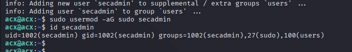

I Tested to make sure i was really a privileged user before proceeding.

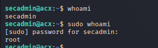


---

# PHASE 4 — SSH KEY AUTHENTICATION

This is where I began  to significantly improve SSH security. To avoid loosing access to the machine since i'm configuring remotely i had to configure `ssh key authentication`.

On my **administration machine**, generated an SSH key.

From Kali:

```bash
ssh-keygen -t ed25519
```

I accepted the default location and then setup passphrase

Copied the public key to Ubuntu:

```bash
ssh-copy-id -i ~/.ssh/ubuntu_lab_ed25519.pub secadmin@192.168.15.6
```

Tested:

```bash
ssh -i ~/.ssh/ubuntu_lab_ed25519 secadmin@192.168.15.6
```
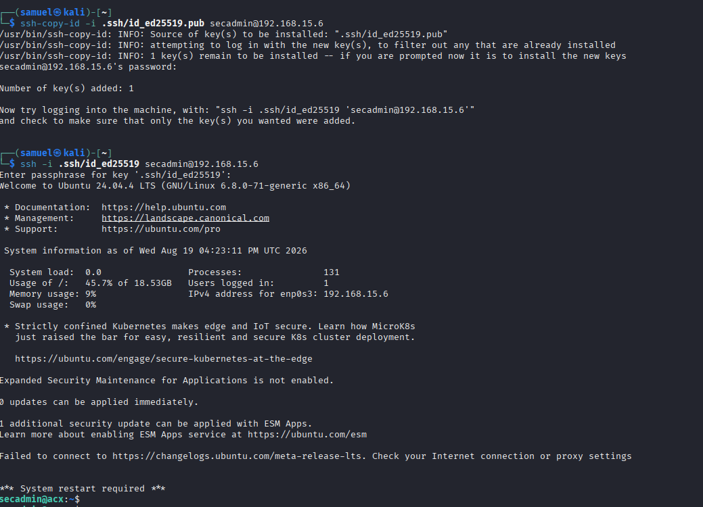

Now that this is working as expected, time to disbale password authentication.

---

## 18. Backup SSH configuration

Before modifying the ssh, it is good practice to backup ssh configuration incase anything goes wrong. So i backed up the ssh config files and the firewall config files.

```bash
sudo cp /etc/ssh/sshd_config \
    /etc/ssh/sshd_config.bak.$(date +%Y%m%d-%H%M%S)
```

Also I inspected any drop-in configuration:

```bash
sudo ls -la /etc/ssh/sshd_config.d/
```

>Modern Ubuntu installations may use configuration snippets there, so don't assume `/etc/ssh/sshd_config` is the only source of configuration.

---

## 19. Harden SSH Configuration

The first thing i did was to backup the sshd_config before making any modifications 

I opened the config file:

```bash
sudo nano /etc/ssh/sshd_config
```
For this lab, I established a policy along these lines:

```text
# Authentication
PermitRootLogin no                  # Disable direct root login
PubkeyAuthentication yes            # Keep key-based login enabled
PasswordAuthentication no           # Disable password login (after key setup)
PermitEmptyPasswords no             # Already set, but ensure

# Login & session
MaxAuthTries 4                      # Reduce brute-force attempts
LoginGraceTime 60                   # Reduce login grace period
ClientAliveInterval 300             # Send keepalive every 5 min
ClientAliveCountMax 3               # Disconnect after 3 missed keepalives (15 min idle)

# Disable unnecessary features
X11Forwarding no
AllowTcpForwarding no
AllowAgentForwarding no
AllowStreamLocalForwarding no
PermitTunnel no

# Harden algorithms (remove weak MACs)
# Use only strong HMACs (no hmac-sha1, no umac-64)
MACs hmac-sha2-512-etm@openssh.com,hmac-sha2-256-etm@openssh.com,umac-128-etm@openssh.com,hmac-sha2-512,hmac-sha2-256,umac-128@openssh.com

# Hide OS banner
DebianBanner no
```

These are the major configurations others were just for additional layer of security.

```text
PermitRootLogin no
PubkeyAuthentication yes
PasswordAuthentication no
PermitEmptyPasswords no
MaxAuthTries 3
LoginGraceTime 30
X11Forwarding no
```

---

# 20. Validate SSH configuration

After configuration i made sure to validate the confugrarion to avoid loading blindly and misconfiguration in the future

I ran:

```bash
sudo sshd -t
```
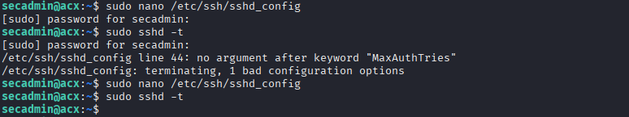

If there is no output, syntax validation succeeded.

Then inspected the effective values:

```bash
sudo sshd -T | grep -E \
'permitrootlogin|pubkeyauthentication|passwordauthentication|permitemptypasswords|maxauthtries|logingracetime|x11forwarding'
```
They all came out as expected.

---

## 21. Reload SSH
Next thing i did was to reload the ssh service, though that didn't shutdown my current sessions.

```bash
sudo systemctl reload ssh
```

Check:

```bash
sudo systemctl status ssh
```

I kept the current SSH sessions open.

From another terminal, I established a **new** connection:

```bash
ssh -i ~/.ssh/id_ed25519 secadmin@192.168.15.6
```
Only after a successful login did i close the previous sessions i opened to test if my configurations really worked

---

# PHASE 5 — FIREWALL Configuration

Time to disallow unwanted traffic from coming through or going out of the server.

```bash
sudo apt install ufw
```

I had the firewall installed so there was no point running the above command.

Before enabling it, I allowed SSH:

```bash
sudo ufw allow OpenSSH
```

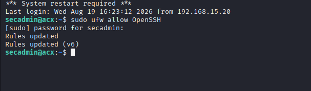

Then established the default policy:

```bash
sudo ufw default deny incoming
sudo ufw default allow outgoing
```

Enabled the firewall:

```bash
sudo ufw enable
```

Checked status:

```bash
sudo ufw status verbose
```
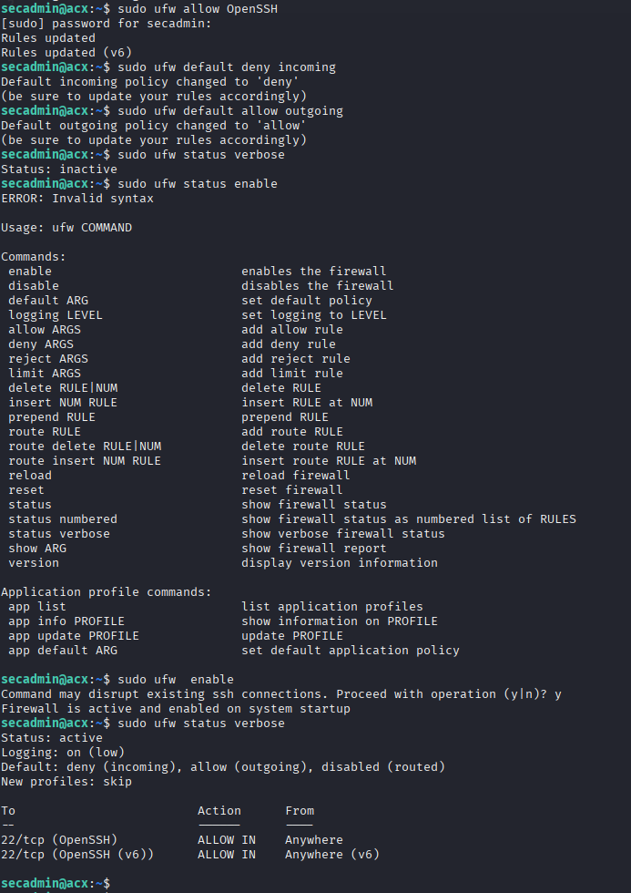

---

## 22. Why SSH must be allowed first

If i enabled the firewall:

```bash
sudo ufw enable
```

before permitting SSH, i am agt the risk of locking myself out of the remote machine.

The safe sequence is:

```text
Configure SSH rule
       ↓
Verify rule
       ↓
Enable firewall
       ↓
Test new SSH connection
```

---

## 23. Restrict SSH further

Now that the basic firewall works, I can restrict SSH to the management network.

For example, if the administrative subnet is:

```text
192.168.56.0/24
```

I could use:

```bash
sudo ufw delete allow OpenSSH
sudo ufw allow from 192.168.56.0/24 to any port 22 proto tcp
```

Then:

```bash
sudo ufw status numbered
```

But then i didn't do that since the Server's IP coukd vary depending on what i'm working on at that point in time.

---


# PHASE 6 — SERVICE HARDENING

List services:

```bash
systemctl list-unit-files --type=service
```

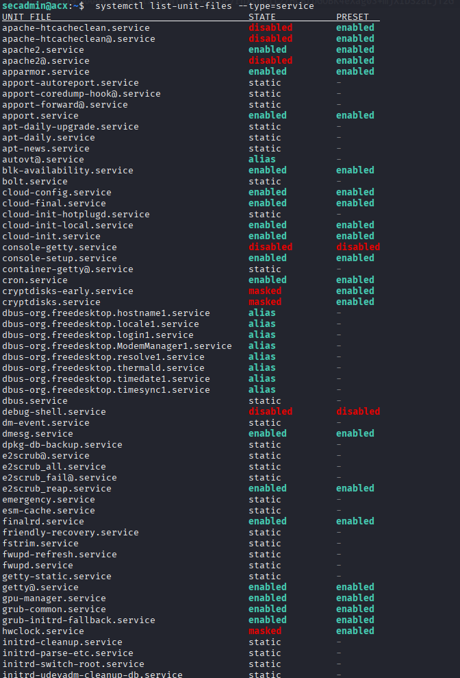

I looked for services that wetre not needed, for this server some of the services which i found unnecessary are these the following and were disbled to reduce attack surface.

```bash
# Stop and disable services
sudo systemctl disable --now ModemManager
sudo systemctl disable --now fwupd
sudo systemctl disable --now multipathd
sudo systemctl disable --now udisks2
sudo systemctl disable --now upower

# I Verified to make sure they are inactive
systemctl status ModemManager fwupd multipathd udisks2 upower --no-pager
```

# PHASE 7 — NETWORK HARDENING

I created a sysctl configuration drop-in:

```bash
sudo nano /etc/sysctl.d/99-security-hardening.conf
```

A conservative lab configuration can include:

```text
# Enable SYN cookies
net.ipv4.tcp_syncookies = 1

# Disable IPv4 source routing
net.ipv4.conf.all.accept_source_route = 0
net.ipv4.conf.default.accept_source_route = 0

# Disable ICMP redirects
net.ipv4.conf.all.accept_redirects = 0
net.ipv4.conf.default.accept_redirects = 0

# Disable secure ICMP redirects
net.ipv4.conf.all.secure_redirects = 0
net.ipv4.conf.default.secure_redirects = 0

# Don't send ICMP redirects
net.ipv4.conf.all.send_redirects = 0
net.ipv4.conf.default.send_redirects = 0

# Reverse path filtering
net.ipv4.conf.all.rp_filter = 1
net.ipv4.conf.default.rp_filter = 1
```

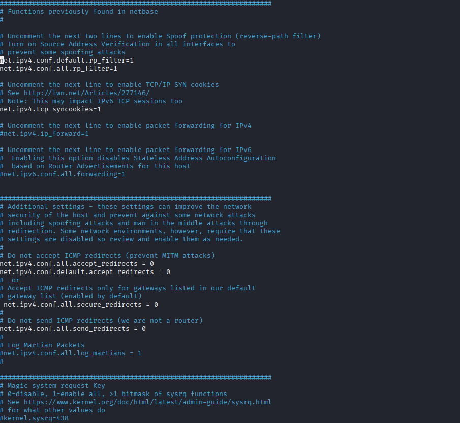

Apply:

```bash
sudo sysctl --system
```

Verify:

```bash
sysctl net.ipv4.tcp_syncookies
```

Ubuntu explicitly identifies SYN cookies as a supported security feature.

---

# PHASE 8 — AUTOMATIC SECURITY UPDATES

Install:

```bash
sudo apt install unattended-upgrades
```

Enable:

```bash
sudo dpkg-reconfigure unattended-upgrades
```

Check:

```bash
systemctl status unattended-upgrades
```

Check the timers:

```bash
systemctl list-timers | grep apt
```

Inspect logs:

```bash
sudo ls -la /var/log/unattended-upgrades/
```

Ubuntu recommends configuration through drop-in files rather than modifying the original `50unattended-upgrades` file directly. 

---

# PHASE 9 — PASSWORD POLICY

Install the password-quality module:

```bash
sudo apt install libpam-pwquality
```

Inspect:

```bash
sudo nano /etc/security/pwquality.conf
```

For the lab, establish a reasonable policy rather than an unnecessarily complex one.

For example:

```text
minlen = 12
```

The exact password policy should depend on organizational requirements.

Remember:

> Strong password policy is useful, but SSH keys plus appropriate account controls are generally preferable for administrative SSH access.

---

# PHASE 10 — FILE PERMISSIONS

Inspect sensitive files:

```bash
ls -l /etc/passwd
ls -l /etc/shadow
ls -l /etc/group
ls -l /etc/gshadow
```

Expected security properties include:

```text
/etc/passwd     readable
/etc/shadow     restricted
/etc/gshadow    restricted
```

Check:

```bash
stat /etc/shadow
```

---

## 27. SSH key permissions

For `secadmin`:

```bash
sudo find /home/secadmin/.ssh -maxdepth 2 -type f -exec ls -l {} \;
```

Typical expectations:

```text
.ssh              700
authorized_keys   600
private key       600
public key        644
```

Fix the directory:

```bash
sudo chmod 700 /home/secadmin/.ssh
```

Fix authorized keys:

```bash
sudo chmod 600 /home/secadmin/.ssh/authorized_keys
```

Correct ownership:

```bash
sudo chown -R secadmin:secadmin /home/secadmin/.ssh
```

---

# PHASE 11 — APPARMOR

Check status:

```bash
sudo aa-status
```

Look for profiles in:

```text
enforce
complain
```

An AppArmor profile in enforce mode restricts the application's behavior according to its policy.

Don't disable AppArmor globally simply to make an application work.

If an application is legitimately blocked, investigate its logs and policy.

---

# PHASE 12 — AUDIT LOGGING

Install auditd:

```bash
sudo apt install auditd audispd-plugins
```

Enable:

```bash
sudo systemctl enable --now auditd
```

Check:

```bash
sudo systemctl status auditd
```

Search authentication-related events:

```bash
sudo ausearch -m USER_LOGIN
```

You can also inspect SSH logs:

```bash
sudo journalctl -u ssh
```

And:

```bash
sudo journalctl --since today
```

---

## 28. Failed authentication investigation

Depending on Ubuntu's logging configuration:

```bash
sudo journalctl _SYSTEMD_UNIT=ssh.service
```

You can search for failures:

```bash
sudo journalctl -u ssh | grep -i "failed"
```

This is useful for establishing the basis of a detection workflow.

---

I wrote a hardening script to automate hardening process

script can be found in [Hardening script](scripts/harden.sh)

---

# 29. Why this isn't yet production-ready

Notice something important.

We intentionally haven't automated every possible hardening action.

A production hardening script needs:

```text
Idempotency
Configuration validation
Backups
Rollback
Error handling
Logging
Dry-run mode
Environment detection
Ubuntu version detection
Service-role awareness
Safe SSH handling
```

For example, this is dangerous:

```bash
sed -i 's/PasswordAuthentication yes/PasswordAuthentication no/' \
    /etc/ssh/sshd_config
```

because:

* the setting might not exist
* it might exist in another configuration file
* another configuration directive might override it
* you could lock yourself out

That's exactly the kind of issue this project should teach you to avoid.

---
